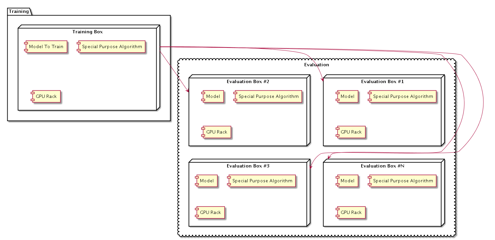

# Overall System Architecture
## Requirements
    - *Scalability*: 
      System architecture should be scalable and high performant (in terms of traininig and evaluation).
    - *High Performancy*: 
      Since there will be multiple concurrent searches, and every search will take valuable amount of time, previous results should be cached.
      Cache will be wiped every time main database of people profiles is updated
      We should monitor for most frequent searches and cache results only for them, while searches performed one or few times won't be cached to save memory and drive space
    
## Other requirements:
    - Model, once trained for some search purpose could be easily distributed between evaluation nodes I'd suggest using of dockerized containers (some for training and other for real-time evaluation).

Basically system architecture will look like that:

Training box will be used most of the time to train all special purposes models using probably slightly modified alorigthm. According to suggestions NN guy gave me, we might use Inception v3 network. 
Traning it from scratch is time consuming operation, however once all special purpose algos and models are trained it could be put down to save hosting cost and be running only once it's needed next time 
for next alorithm/model train. We will apparently have several purposes (so models and algos) depending on type of information consumers need to receive as the result of their searches.

Evaluation boxes will also be used all the time, they will serve large datasets searching for appropriate data according to consumer's search.

## System hardware requirements
    - training box is distributed among 5 high performant 128Gb/10TB 6-12 Nvidia GPU machines
    - evaluation boxes: depends on number of concurrent searches and overall database size and complexity (in terms of fields in persons profiles)
    
## System Software Requirements
    - OS: Amazon/Ubuntu Linux with recent 4.x kernel
    - DB: MongoDB 3.3+
    - AI: Google TenserFlow 1.x
    - JVM: v1.8 or higher
